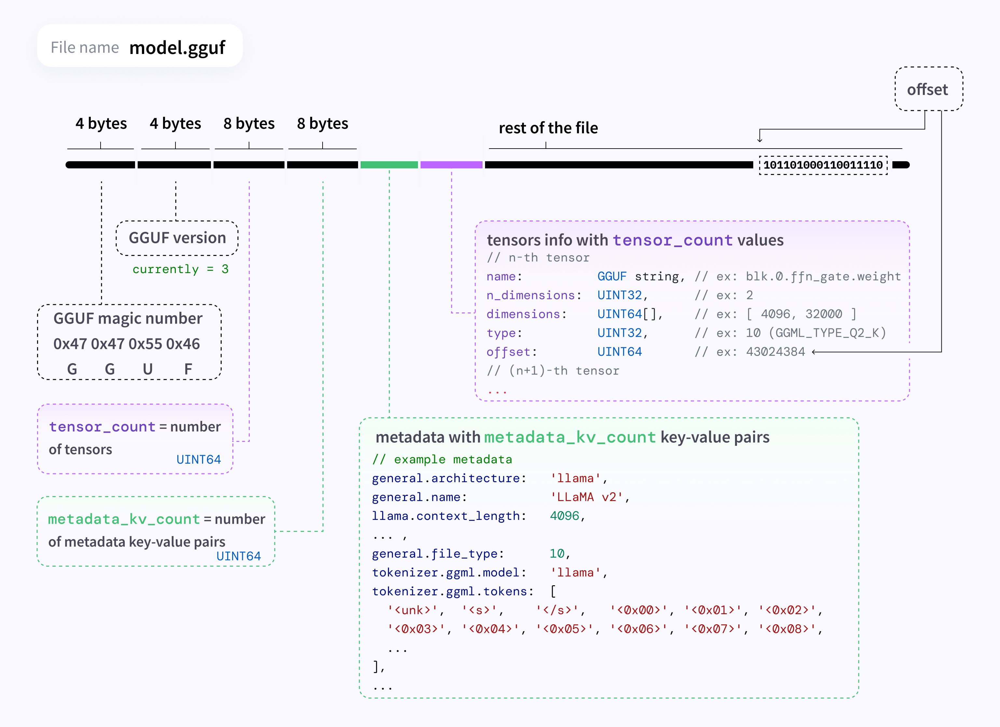

# gguf-mindspore

本项目帮助用户快速的将 MindSpore 生成的大模型的 ckpt 文件，转换为 Ollama 可以加载的 GGUF 格式文件，主要思路是针对已有的如 Hugging face 上的对应模型的 GGUF 文件，利用 MindSpore 生成的 ckpt 文件，替换掉 GGUF 文件中的张量信息部分，生成自己的 GGUF 文件。


## 依赖

```python
gguf==0.6.0
mindspore
numpy
```

## GGUF 文件一览

gguf 文件格式可以参考 [gguf文档](https://github.com/ggerganov/ggml/blob/master/docs/gguf.md)。



## 快速使用

1. **准备 MindSpore 导出的大模型 ckpt 文件。**

​	本部分可以使用 [mindformers](https://gitee.com/mindspore/mindformers#/mindspore/mindformers/) 里面提供的 ckpt 文件，如 llama2-7b 对应的 ckpt 文件下载地址：[llama2-7b-ckpt](https://gitee.com/link?target=https%3A%2F%2Fascend-repo-modelzoo.obs.cn-east-2.myhuaweicloud.com%2FMindFormers%2Fllama2%2Fllama2_7b.ckpt) 。你也可以使用自己训练得到的 ckpt 文件。

2. **下载作为参考的 gguf 文件用于 gguf 结构信息提取。**

   本部分可以在 hugging face 等平台下载对应的模型的 gguf 文件。

3. **在 <kbd>models</kbd> 目录下创建对应的模块**

​	如在 models 下创建 models/llama2 ，本部分的目的是创建一个模块用于相关模型配置文件存放。

4. **从 gguf 文件中提取超参数信息**

​	使用 ***make_gguf_meta_data_json.py*** 来从 gguf  文件中提取相关超参数。会生成一个 json 文件，这里展示一个样例（只包含了部分内容）

```json
{
   "general.architecture": "llama",
   "general.name": "LLaMA v2",
   "llama.context_length": 4096,
   "llama.embedding_length": 4096,
   "llama.block_count": 32,
   "llama.feed_forward_length": 11008,
   "llama.rope.dimension_count": 128,
   "llama.attention.head_count": 32,
   "llama.attention.head_count_kv": 32,
   "llama.attention.layer_norm_rms_epsilon": 9.999999747378752e-06,
   "general.file_type": 10,
   "tokenizer.ggml.model": "llama"
}
```

5. **获得 MindSpore ckpt 到 GGUF 的 layer 名称的映射字典**

​	如同一层，在 MindSpore 里导出的名称为： model.layers.13.feed_forward.w1.weight ，gguf 格式文件统一名称为： blk.13.ffn_gate.weight，那么就需	要加入以下映射关系，才能将名称转换为 gguf 格式文件的名称。最终得到一个类似 models/llama2/configs/llama2_layer_name_map.json 的 Json 文件

```json
{
  "model.layers": "blk",
  "feed_forward.w1": "ffn_gate",
}
```

5.  **修改参数执行 main_writer.py 获得对应的 gguf 文件**

```python
if __name__ == '__main__':
    writer = Writer(metadata_json_path="llama2/configs/llama2-7b-gguf-metadata.json",  # 步骤 4 中获取的超参数信息 json 文件
                    layer_name_map_json_path="llama2/configs/llama2_layer_name_map.json",  # 步骤 5 中生成的 layer 名称映射字典
                    ckpt_file_path="llama2/llama2_7b.ckpt",  # MindSpore 格式的 ckpt 文件
                    arch="llama", # 模型架构
                    need_transpose=False)  # tensor 是否需要转置
    writer.write()
```

​	特别需要注意的是，MindSpore 导出的 ckpt 文件的 tensor 可能和 gguf 的 tensor 文件是是转置关系，可以通过 mindspore.load_checkpoint() 读取 tensor 字典，以及通过 GGUFLoader() 读取 GGUFLoader 实例属性  tensor_infos，对比相同层张量是否有转置关系。

6. **在 Ollama 中导入你的模型**

   首先编写你的 modelfile 文件，这很简单，你可以参考 Ollama 官方提供的 [modelfile_template]("https://github.com/ollama/ollama/blob/main/docs/modelfile.md") 也可以网上随便找个模板。当然你最简单的可以直接将下面的语句复制到文本文档里，然后将后缀修改为 ***.mf***。

```shell
from ./example.gguf
```

​	编写好 modelfile 文件后，比如文件名称叫 llama2_ms.modelfile，那么在命令窗口执行

```shell
ollama create [取一个模型名称] -f llama_ms.modelfile
# 举个例子
ollama create llama2_new -f llama2_ms.modelfile
# here we go!
ollama run llama2_new
```


